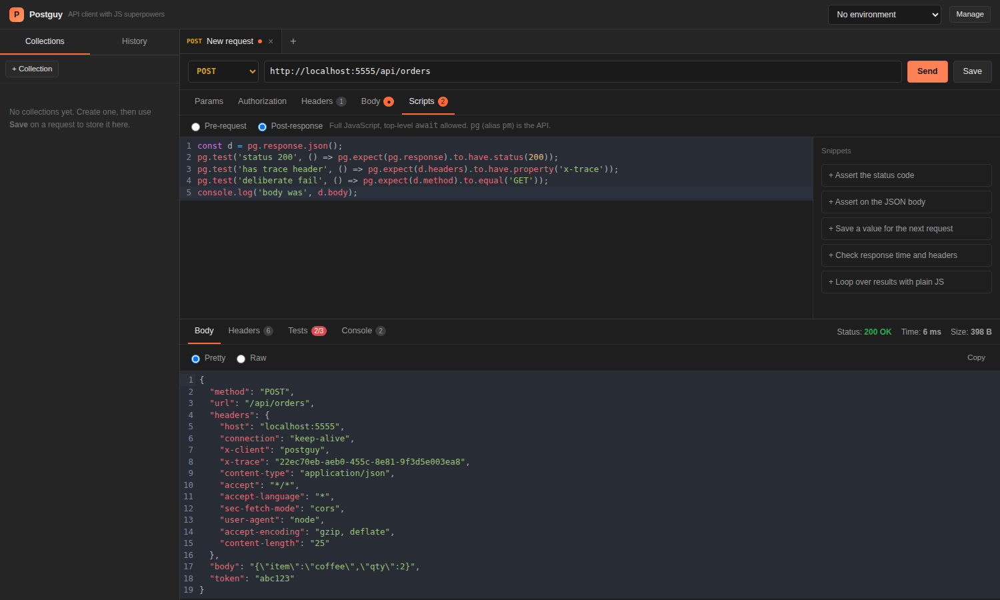

# Postguy

An API client with a Postman-style interface — built entirely in JavaScript, with one
deliberate difference: **scripting is a first-class feature, not an afterthought.**

Every request gets a real JavaScript runtime before and after it is sent. You can rewrite
the request on the fly, chain calls, compute signatures, assert on the response, and push
values back into your environment — all in plain JS, with `await` available at the top level.



## Features

**The Postman part**

- `GET` / `POST` / `PUT` / `PATCH` / `DELETE` / `HEAD` / `OPTIONS`
- Query params, headers, and bodies — `raw` JSON/text/XML/HTML, `x-www-form-urlencoded`,
  `form-data` **with real file uploads**, and `binary` to send a file as the whole body
- **Import** a cURL command, a Postman collection (v2.0 / v2.1), a Postman environment export, or an
  OpenAPI 3 / Swagger 2 spec in JSON or YAML — the format is detected, and you see a preview of
  every request before anything is saved
- **Code generation** — turn the request in front of you into cURL, `fetch`, axios or Python
  `requests`, with the auth applied so the snippet runs as-is
- Authorization helpers: Bearer token, Basic auth, API key (header or query)
- Collections, saved requests, and request history
- Environments with `{{variable}}` substitution anywhere — URL, headers, body, auth
- Dynamic variables: `{{$uuid}}`, `{{$timestamp}}`, `{{$isoTimestamp}}`, `{{$randomInt}}`, and friends
- Multi-tab workspace, restored when you reopen the app
- Response viewer with pretty-printed JSON, headers, timing and size
- Collection runner — runs every request in order through one shared environment

**Getting connected**

- **Proxy pool** — paste a list of proxies (`host:port:user:pass` and the other usual formats) and
  requests rotate across them: round-robin, sticky-per-host, random, or first-healthy. "Test all"
  checks every proxy in parallel and reports its exit IP, country and latency; a proxy that will not
  connect is skipped and the request retries on the next one. Per-host bypass list, and Basic
  `Proxy-Authorization` per entry. HTTPS goes through `CONNECT`, so pointing the pool at a single
  intercepting proxy works too.
- **Cookie jar** — `Set-Cookie` is captured and replayed on matching requests, so you hit a login
  endpoint once and stay logged in. Domain/path/secure matching, expiry and `Max-Age` are honoured,
  and cookies carry across redirect hops (the usual `POST /login` → `302` → `/me` flow).
- **OAuth 2.0** — fetch a token with the client-credentials or password grant, with the client
  secret sent in the body or as a Basic header, then reuse it as the request's bearer token.
- **Request settings** — timeout, redirect following and limit, and a TLS-verification toggle for
  dev servers with self-signed certificates.

**Script tabs — jobs, not requests**

A second kind of tab. Instead of one request with a script attached, it is a script that runs on a
schedule you set in the toolbar:

- **Iterations**, **concurrency** and **interval** (ms / sec / min / hour) — the script describes a
  single iteration and the runner repeats it. `concurrency 1 + interval 15s` is a slow poller;
  `concurrency 10 + interval 0` is a load burst. Lanes pull from a shared queue, so a slow call
  never holds up the others.
- **Every call is logged** — the Requests tab lists each `pg.sendRequest()` with status, time, size
  and which proxy it went out through; click one to read its full response, pretty-printed.
- **`pg.record({ ... })`** adds a row to the Results table, which builds a column per key.
- **Per-tab variables** (`pg.vars`) live with the script and keep whatever the run wrote back, so a
  token fetched on the first run is there on the next.
- Jobs run on the server: closing the tab or reloading the page does not stop them, and reopening
  reattaches to the live output. **Stop** ends the run at the next iteration boundary.

```js
const base = pg.vars.get('baseUrl');
const res = await pg.sendRequest(`${base}/dashboard?bot=${pg.job.iteration}`);
const data = res.tryJson() ?? {};

pg.record({ bot: pg.job.iteration, status: res.status, coins: data.coins, ms: res.time });
```

With a proxy pool switched on, concurrent iterations each take the next proxy, so ten lanes go out
from ten different IPs.

**The part that makes it different**

Two script slots per request, both full JavaScript:

| Phase | Runs | Can do |
| --- | --- | --- |
| Pre-request | before the request is sent | rewrite method/URL/headers/body, set variables, chain other requests, skip the request |
| Post-response | after the response arrives | assert with `pg.test` / `pg.expect`, parse the body, save values for the next request |

Because it is real JavaScript, things Postman makes awkward are just code:

```js
// Pre-request: log in once, reuse the token everywhere
const login = await pg.sendRequest({
  method: 'POST',
  url: pg.env.get('baseUrl') + '/login',
  headers: { 'Content-Type': 'application/json' },
  body: { mode: 'raw', raw: JSON.stringify({ user: 'demo', pass: 'demo' }) },
});
pg.env.set('token', login.json().accessToken);

// Pre-request: sign the payload
pg.request.headers['X-Signature'] = pg.utils.hmac('sha256', pg.env.get('secret'), pg.request.body.raw);

// Pre-request: build a body from a loop
pg.request.body.raw = JSON.stringify({
  items: Array.from({ length: 20 }, (_, i) => ({ sku: `SKU-${i}`, qty: pg.utils.randomInt(1, 9) })),
});
```

```js
// Post-response: generate a test per row in the response
const users = pg.response.json();
for (const user of users) {
  pg.test(`user ${user.id} has a valid email`, () => pg.expect(user.email).to.include('@'));
}
pg.env.set('firstUserId', users[0].id);
```

## Quick start

```bash
npm install
npm run dev
```

- UI: http://localhost:5173
- API: http://localhost:4000

For a single-port production-style run:

```bash
npm run build   # builds the client
npm start       # server serves the API and the built UI on :4000
```

Requires Node.js 18+ (developed on Node 22).

## Scripting API

Everything hangs off `pg`. `pm` is an alias, so Postman snippets mostly paste in unchanged.

### Request (pre-request phase)

```js
pg.request.method                  // 'POST'
pg.request.url                     // mutable
pg.request.headers['X-Trace'] = pg.utils.uuid();
pg.request.params.page = '2';
pg.request.body.mode = 'raw';
pg.request.body.raw = JSON.stringify({ ok: true });
pg.execution.skipRequest();        // don't send this one
```

### Response (post-response phase)

```js
pg.response.status                 // 200
pg.response.statusText
pg.response.headers                // plain object
pg.response.responseTime           // ms
pg.response.size                   // bytes
pg.response.text()
pg.response.json()                 // throws on invalid JSON
pg.response.tryJson()              // undefined on invalid JSON
pg.response.header('content-type') // case-insensitive lookup
```

### Variables

```js
pg.env.get('token');               // pg.environment is the same object
pg.env.set('token', 'abc');        // persisted back to the active environment
pg.env.unset('token');
pg.env.toObject();
pg.globals.set('runId', 1);        // session-scoped, not persisted
pg.variables.get('anything');      // environment first, then globals
pg.variables.replaceIn('{{baseUrl}}/users');
```

### Tests and assertions

```js
pg.test('name', () => { /* throws == fail */ });   // async callbacks are awaited

pg.expect(value).to.equal(x);          // strict ===
pg.expect(value).to.eql(x);            // deep equality
pg.expect(value).to.be.ok;
pg.expect(value).to.be.a('array');
pg.expect(value).to.include(x);
pg.expect(value).to.match(/re/);
pg.expect(value).to.have.property('id', 7);
pg.expect(value).to.have.lengthOf(3);
pg.expect(value).to.be.above(1).and.below(10);
pg.expect(value).to.be.oneOf(['a', 'b']);
pg.expect(pg.response).to.have.status(200);
pg.expect(value).to.not.equal(x);      // negate anything
```

### Script tabs only

```js
pg.job.iteration                   // 1-based, which repeat this is
pg.job.iterations                  // how many were asked for
pg.job.concurrency
pg.job.stopping                    // true once Stop was pressed
pg.vars.get('token');              // variables that belong to this tab
pg.vars.set('token', 'abc');       // kept for the next run
pg.record({ bot: 3, ok: true });   // one row in the Results table
pg.batch(items, worker, 5);        // run a worker over items, 5 at a time
await pg.sleep(60_000);            // no five-second cap here
pg.stop();                         // end the whole job from inside
```

### Cookies

```js
await pg.cookies.all();                     // everything in the jar
await pg.cookies.get('sid');                // one value, optionally per domain
await pg.cookies.set({ name: 'sid', value: 'abc', domain: 'example.com' });
await pg.cookies.clear('example.com');      // or clear() for the whole jar
```

### Utilities

```js
pg.utils.uuid();
pg.utils.timestamp();                       // unix seconds
pg.utils.isoNow();
pg.utils.randomInt(1, 100);
pg.utils.base64Encode('hi');
pg.utils.base64Decode('aGk=');
pg.utils.hash('sha256', 'data');            // hex digest
pg.utils.hmac('sha256', key, data);
await pg.utils.sleep(200);
await pg.sendRequest('https://example.com'); // or a full request object
console.log('shows up in the Console tab');
```

Standard globals are available too: `fetch`, `crypto`, `Buffer`, `URL`, `URLSearchParams`,
`TextEncoder`/`TextDecoder`, `btoa`/`atob`, timers.

## How a request runs

```
pre-request script  →  resolve {{variables}}  →  HTTP request  →  post-response script
```

Variables resolve *after* the pre-request script, so a script can set a value and have
`{{that}}` pick it up in the same run. Whatever the scripts leave in the environment is saved
back, which is what makes request chaining work across a collection run.

## Project layout

```
server/
  src/lib/http.js        request execution (auth, bodies, timeouts, redirects, cookies)
  src/lib/scripting.js   the JS sandbox and the `pg` API
  src/lib/assert.js      the chai-flavoured expect() used by pg.expect
  src/lib/execute.js     the request lifecycle described above
  src/lib/variables.js   {{variable}} and {{$dynamic}} resolution
  src/lib/proxy.js       the proxy pool — parsing, rotation, bypass, health
  src/lib/jobs.js        the background job runner behind script tabs
  src/lib/import/        cURL, Postman and OpenAPI parsers
  src/lib/cookies.js     the cookie jar — parsing, matching, expiry
  src/lib/oauth.js       OAuth 2.0 token requests
  src/lib/settings.js    persisted proxy/request/cookie settings
  src/routes/            send, collection runner, collections, environments, history, tools
client/
  src/components/        request builder, response viewer, sidebar, modals
  src/store/useStore.js  application state (zustand)
```

Collections, environments, history, cookies and settings persist as JSON files under
`server/data/`. That includes any credentials you type into a request or into the proxy
settings, stored in plain text — it is a local scratchpad, not a secrets manager.

## A note on the sandbox

Scripts run in a Node `vm` context with a trimmed-down global surface and a 15-second
timeout. That is there to stop runaway loops and accidents — it is **not** a security
boundary. Postguy is a local developer tool that runs your own scripts on your own machine;
don't point it at scripts you wouldn't otherwise run.

## Keyboard shortcuts

| Shortcut | Action |
| --- | --- |
| `Ctrl`/`Cmd` + `Enter` | Send request, or run the script in a script tab |
| `Ctrl`/`Cmd` + `S` | Save request |
